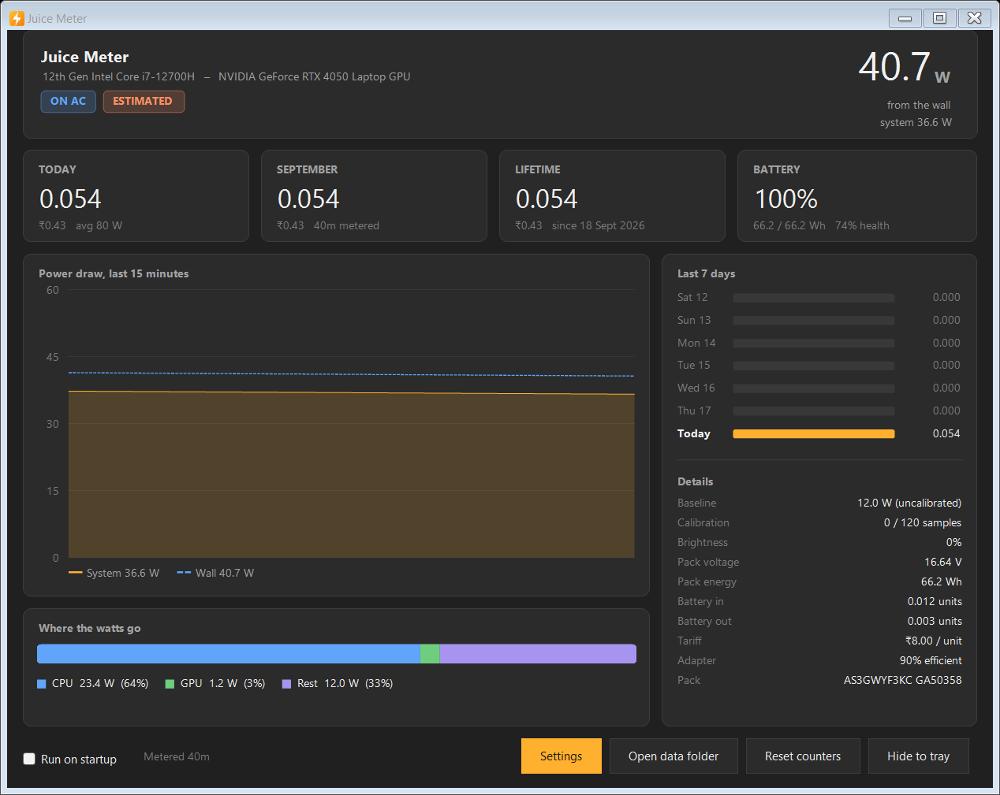

# Juice Meter

Tray applet that measures how many **units** (kWh) of electricity your laptop
pulls from the wall: the thing your bill actually charges you for.

## What it does

- Samples power once a second and integrates it into energy
- Tracks today / this month / lifetime, in units and in money
- Live wattage drawn into the tray icon
- Plain-CSV ledger you can open in a spreadsheet and check

## Why it is not just "read a wattage"

Nothing on a laptop measures wall draw directly, so it uses two sources:

| | Source | Accuracy |
| --- | --- | --- |
| **On battery** | The pack's fuel gauge, over `IOCTL_BATTERY_*` | Measured. The best sensor on the machine. |
| **On AC** | CPU package + GPU + a learned baseline, then adapter losses | Modelled. |

The baseline (panel, board, RAM, SSD, fans) is learned while you are on
battery, bucketed by screen brightness, and replayed on AC. Every reading is
labelled `MEASURED`, `MODELLED` or `ESTIMATED` so you know which you are looking
at.

## Install

1. Download **`JuiceMeter-win-x64-self-contained.zip`** from
   [the latest release](../../releases/latest)
2. Unzip anywhere
3. Right-click `JuiceMeter.exe` → **Run as administrator**

No installer, no service, nothing to uninstall. Delete the folder and it is
gone.

The exe is not code-signed, so the first launch shows **"Windows protected your
PC"**. Click *More info*, then *Run anyway*. You will then get the usual UAC
prompt.

Admin is what unlocks CPU package power. Without it the app still runs and
battery measurement is exact, but AC figures stay rough estimates and the
baseline never learns. Tick **Run on startup** inside the app and it registers a
scheduled task, so it comes back elevated at login with no UAC prompt.

> The self-contained zip is ~60 MB because it carries the .NET runtime.
> `JuiceMeter-win-x64.zip` is the same app at ~1 MB, but needs the
> [.NET 8 Desktop Runtime](https://dotnet.microsoft.com/download/dotnet/8.0)
> already installed.

## Requirements

- Windows 10 or 11, x64
- A laptop with a smart battery (any modern one)

Discrete GPU power needs NVIDIA (NVML). Switching between Standard and Eco in
G-Helper is safe.

## Using it

Closing the window parks it in the tray; quit from the tray menu. The tray icon
shows live watts, with a coloured bar for the source (amber = battery, teal =
charging, blue = AC). Right-click it for today's and this month's units.

| Flag | Effect |
| --- | --- |
| `--tray` | Start hidden in the tray. |
| `--probe [seconds]` | Dump every sensor and how the model turns it into watts, then exit. |
| `--screenshot [file]` | Render the dashboard to a PNG. `--settings`, `--light`, `--dark` also accepted. |

## Your data

`%LOCALAPPDATA%\JuiceMeter\` holds one CSV per month, one row per minute, plus
`state.json` for lifetime totals.

Sleep and hibernate are recorded as **gaps**, not integrated across. "Reset
counters" never deletes anything; it moves the history folder aside.

## Accuracy

Adapter (90%) and charging (92%) efficiency are assumptions, not measurements.
Change them in Settings if you own a wall meter. Anything the package sensors
cannot see (USB charging, an external drive) lands outside the model. A wall
socket meter is still ground truth; this is the closest you get from inside the
machine.

## Built with

.NET 8 + WinForms · [LibreHardwareMonitor](https://github.com/LibreHardwareMonitor/LibreHardwareMonitor)
for CPU/GPU · Win32 `DeviceIoControl` for the battery

Building it yourself needs the .NET 8 SDK: clone, then `.\build.ps1`
(`-SelfContained` to bundle the runtime). Output lands in `dist\`.

## Licence

MIT. See [LICENSE](LICENSE).
